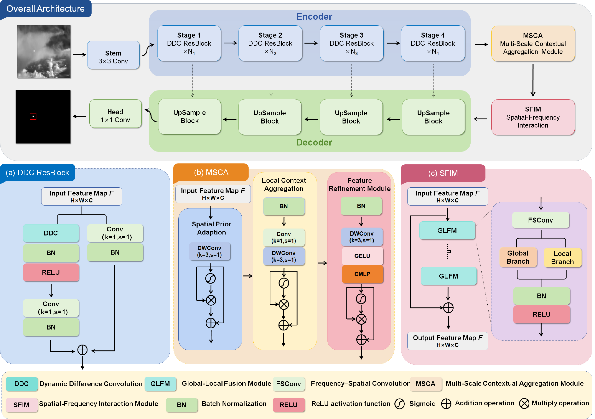

  <h1 style="border-bottom: none;">Dual-Domain Context Interactive Network for Infrared Small Target Detection with Single-Point Supervision</h1>

  

    <a href="https://orcid.org/0009-0005-9250-5464" target="_blank">Haiguang Wang</a>1,2,&nbsp;
    <a>Yunpeng Liu</a>1*,&nbsp;
    <a>Shuyu Hu</a>1,2,&nbsp;
    <a>Qinghua Zhang</a>1,2,&nbsp;
    <a>Zelin Shi</a>1
  

  

    1 Shenyang Institute of Automation, Chinese Academy of Sciences
     
    2 School of Computer Science and Technology, University of Chinese Academy of Sciences
     
    * Corresponding author
  

  
  
  
  

## 💥 Abstract

Infrared small target detection plays a vital role in both civilian and military applications, yet it remains challenged by weak target signals, complex background clutter and the difficulty of preserving shape integrity. Current mainstream deep learning methods, mostly relying on pixel-level annotations, have achieved remarkable progress in detection accuracy. However, such approaches heavily depend on large-scale fine-grained annotations, leading to prohibitive labeling costs. To alleviate the annotation burden, some studies have attempted to introduce point-supervised strategies, but the extremely limited supervision information severely degrades detection performance. To address these issues, we propose a novel dual-domain context interactive network (DCI-Net).

Specifically, we first design a dynamic difference convolution (DDC), which adaptively amplifies the feature responses of potential targets while suppressing background clutter by learning to the contribution of difference convolution information. Then, we develop a multi-scale contextual aggregation module (MSCA), which leverages multi-scale gating to aggregate local contextual information and refines features without requiring extra negative annotations, mitigating the false reinforcement of salient background clutter. Finally, we introduce a spatial-frequency interactive module (SFIM), which establishes bidirectional interaction between frequency and spatial domains to encourage target features to exhibit more compact and consistent spatial distribution while remaining distinct from background patterns. Extensive experiments on multiple infrared small target datasets demonstrate that under the point-supervised setting, our DCI-Net achieves superior detection performance compared to existing methods.

## 🚀 Overview

 
  
 

## ✅ TODO List

We are preparing the release of the paper and code. Please stay tuned.

- [ ] Release paper.
- [ ] Release training and inference code.

## 📫 Contact

For questions about this work, please contact:

- Haiguang Wang: wanghaiguang@sia.cn
